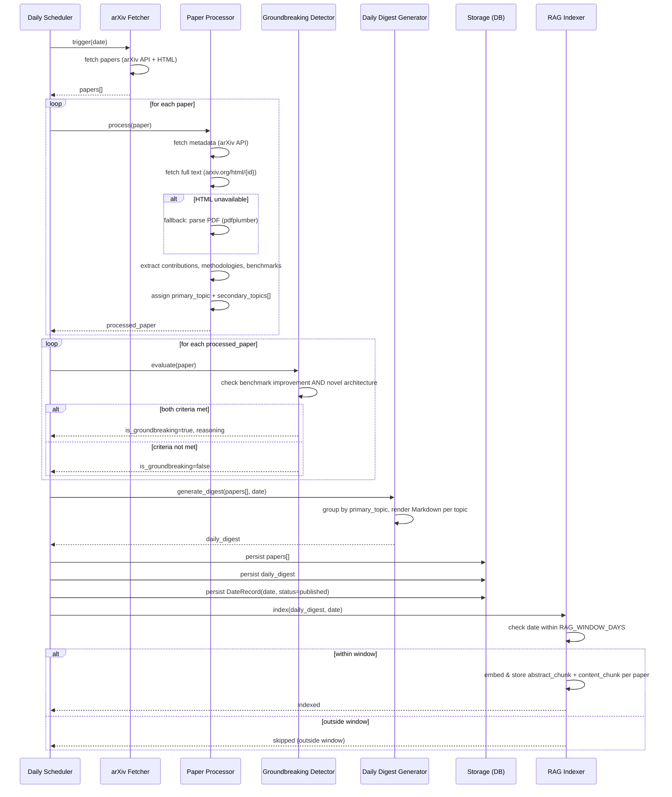
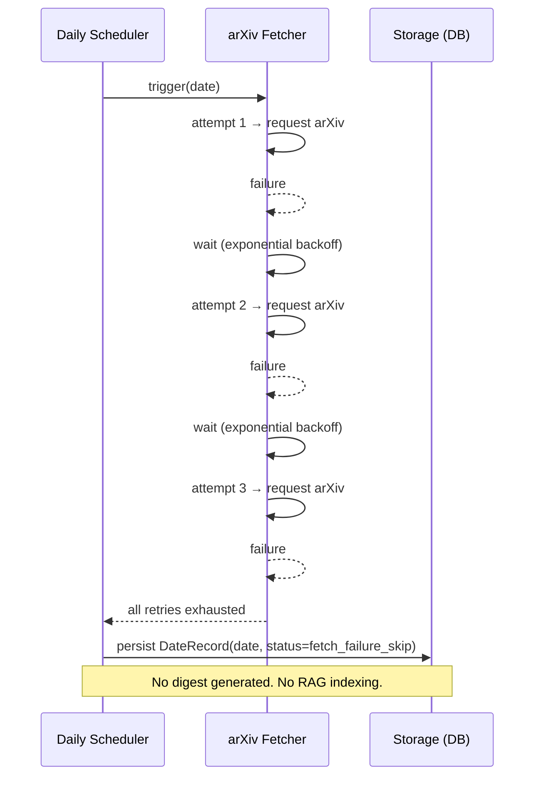
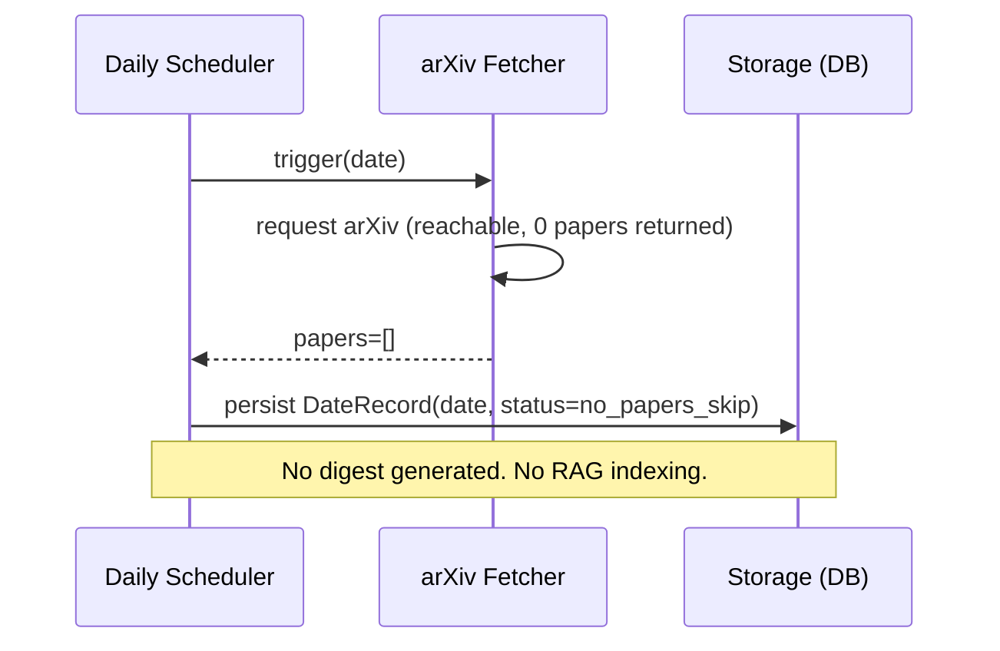
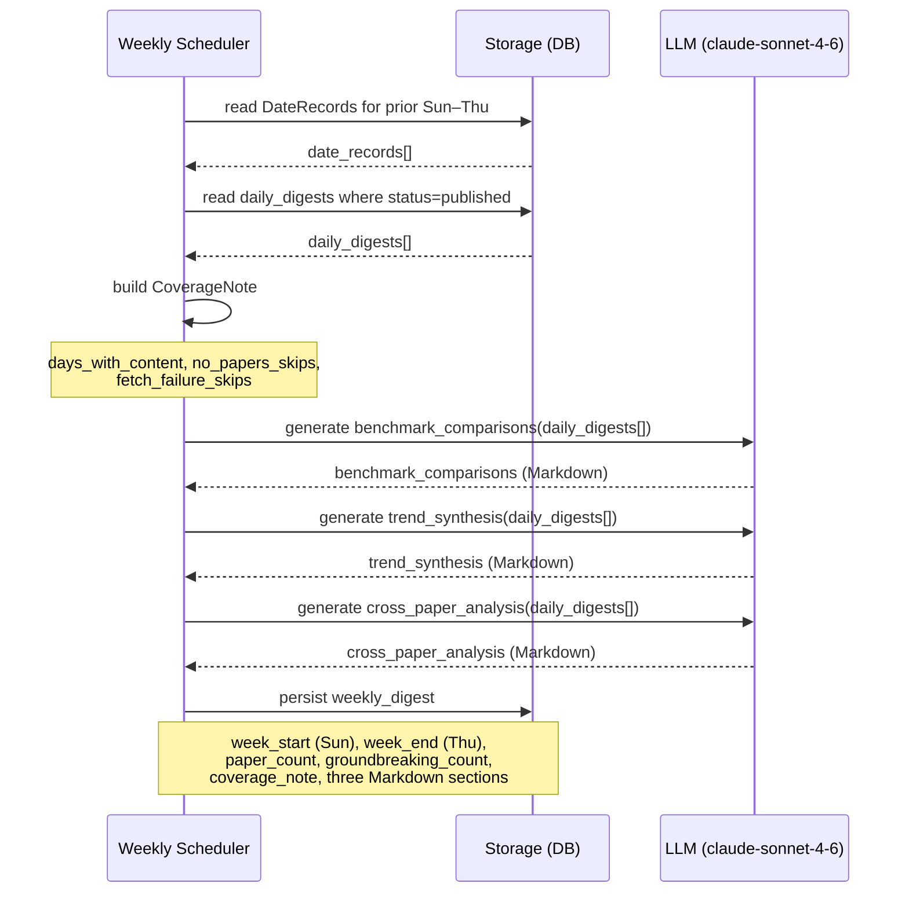
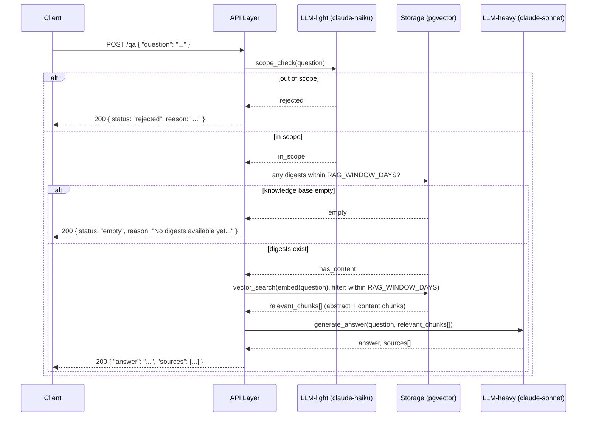

# System Design: ArXiv Intelligence Agent

**Feature**: `001-arxiv-intelligence-agent`
**Created**: 2026-04-23
**Status**: Draft
**Spec**: [spec.md](spec.md)

---

## 1. System Overview

ArXivAgent is an always-on background service that monitors arXiv daily, synthesizes
ML research papers into structured digests, and exposes those digests — plus a
conversational Q&A interface — through HTTP endpoints.

The system has two distinct runtime modes:

- **Pipeline mode** (scheduler-driven): fetch papers → extract → classify → generate digest
- **Query mode** (request-driven): serve stored digests or answer RAG-grounded questions

---

## 2. High-Level Architecture

```
┌────────────────────────────────────────────────────────────────┐
│                        Schedulers                              │
│   ┌──────────────────────────┐   ┌──────────────────────────┐  │
│   │  Daily Scheduler         │   │  Weekly Scheduler        │  │
│   │  20:30 ET, Sun–Thu       │   │  01:00 ET, Fri           │  │
│   └────────┬─────────────────┘   └─────────────┬────────────┘  │
└────────────│──────────────────────────────────│───────────────-┘
             │                                  │
             ▼                                  ▼
┌────────────────────────┐    ┌─────────────────────────────────┐
│   Pipeline             │    │   Weekly Digest Generator       │
│                        │    │   - Aggregates Sun–Thu digests  │
│  ┌──────────────────┐  │    │   - Benchmark comparisons       │
│  │  arXiv Fetcher   │  │    │   - Trend synthesis             │
│  │  (retry 3×)      │  │    │   - Cross-paper analysis        │
│  └────────┬─────────┘  │    │   - Coverage note (skips)       │
│           │            │    └──────────────┬──────────────────┘
│           ▼            │                   │
│  ┌──────────────────┐  │                   │
│  │ Paper Processor  │  │                   │
│  │ - Contributions  │  │                   │
│  │ - Methodologies  │  │                   │
│  │ - Benchmarks     │  │                   │
│  │ - Topic assign   │  │                   │
│  └────────┬─────────┘  │                   │
│           │            │                   │
│           ▼            │                   │
│  ┌──────────────────┐  │                   │
│  │ Groundbreaking   │  │                   │
│  │ Detector         │  │                   │
│  └────────┬─────────┘  │                   │
│           │            │                   │
│           ▼            │                   │
│  ┌──────────────────┐  │                   │
│  │ Daily Digest     │  │                   │
│  │ Generator        │  │                   │
│  └────────┬─────────┘  │                   │
└───────────│────────────┘                   │
            │                                │
            ▼                                ▼
┌───────────────────────────────────────────────────────────────┐
│                         Storage                               │
│                                                               │
│   Papers DB          Digests DB          Date Records DB      │
│   (all papers)       (daily + weekly,    (published /         │
│                       indefinite)         no_announcement /   │
│                                           no_papers_skip /    │
│                                           fetch_failure_skip) │
└──────────────────────────────┬────────────────────────────────┘
                               │
                    ┌──────────┴──────────┐
                    │                     │
                    ▼                     ▼
         ┌──────────────────┐   ┌──────────────────────┐
         │  RAG Indexer     │   │  API Layer           │
         │                  │   │                      │
         │  Indexes digests │   │  GET /digests/daily  │
         │  within          │   │  GET /digests/weekly │
         │  RAG_WINDOW_DAYS │   │  POST /qa            │
         │  window only     │   │                      │
         └──────────────────┘   └──────────────────────┘
```

---

## Technology Stack

| Layer | Technology | Rationale |
|-------|-----------|-----------|
| **Runtime** | Python 3.12 | Best ecosystem for ML/AI tooling, LLM SDKs, and arXiv clients |
| **API Framework** | FastAPI | Async-first, automatic OpenAPI docs, type-safe; fits an API-only service |
| **Scheduler** | APScheduler | In-process cron scheduler; no separate infrastructure needed for v1 |
| **Database** | PostgreSQL 16 | Relational, robust JSON support for digest bodies; single DB for papers, digests, and date records |
| **ORM / Migrations** | SQLAlchemy + Alembic | Mature Python ORM with schema migration support |
| **Vector Store** | pgvector (PostgreSQL extension) | Stores embeddings in the same PostgreSQL instance; no separate vector DB service needed |
| **Embedding Model** | `BAAI/bge-small-en-v1.5` via `sentence-transformers` | High-quality embeddings for ML text; runs locally with no per-token API cost |
| **LLM — heavy tasks** | `claude-sonnet-4-6` via Anthropic SDK | Paper extraction, groundbreaking detection, digest generation, weekly synthesis, Q&A answers |
| **LLM — light tasks** | `claude-haiku-4-5-20251001` via Anthropic SDK | Topic classification, out-of-scope query detection; lower cost for high-frequency calls |
| **arXiv metadata** | `arxiv` Python library | Community wrapper around arXiv API for structured metadata (title, authors, abstract) |
| **arXiv full text** | `httpx` (async) | Fetches `arxiv.org/html/{id}` for contributions, methods, benchmarks |
| **PDF fallback parser** | `pdfplumber` | Structured text extraction from academic PDFs when HTML is unavailable |
| **Dependency management** | `uv` | Fast Python package and project manager |
| **Testing** | `pytest` + `pytest-asyncio` | Standard Python testing with async support for FastAPI and scheduler components |
| **Linting / Formatting** | `ruff` | Fast, all-in-one Python linter and formatter |

### Key Stack Decisions

**PostgreSQL + pgvector over a separate vector DB**: keeping one infrastructure
component (PostgreSQL) handles relational data, JSON digest bodies, and vector
embeddings in v1. A dedicated vector DB (Qdrant, Weaviate) is a future upgrade if
pgvector's performance proves insufficient at scale.

**Local embeddings over API embeddings**: at 100–500 papers/day, embedding costs
on a hosted API accumulate quickly. `BAAI/bge-small-en-v1.5` runs in-process,
has strong performance on scientific/ML text, and keeps the system self-contained.

**Two Claude model tiers**: Sonnet for tasks requiring deep reasoning (extraction,
generation, Q&A); Haiku for binary/classification tasks (is this query in-scope?
what topic does this paper belong to?) where latency and cost matter more than
depth.

**APScheduler over Celery/Redis**: Celery adds a message broker dependency for a
scheduling problem that two cron jobs can solve. APScheduler runs in-process, uses
the same cron expressions defined in `DAILY_SCHEDULER_TIME` and
`WEEKLY_SCHEDULER_TIME`, and is replaceable later if task queue needs emerge.

---

## 3. Component Design

### 3.1 Schedulers

Two independent schedulers drive the pipeline:

| Scheduler | Trigger | Responsibility |
|-----------|---------|----------------|
| Daily Scheduler | **20:30 ET, Sun–Thu** | Trigger arXiv fetch → process → generate daily digest |
| Weekly Scheduler | **01:00 ET, Friday** | Aggregate prior Sun–Thu daily digests → generate weekly digest |

**Why these times**:
- arXiv announces new submissions at exactly **20:00 ET, Sunday through Thursday**.
  Friday and Saturday have no announcements — arXiv does not publish on those days.
- The daily scheduler fires at **20:30 ET** (30-minute buffer after arXiv publish) to
  ensure the listing is fully propagated before fetching begins.
- The weekly scheduler fires at **01:00 ET Friday** — after Thursday's daily digest
  (the last of the announcement week) has fully completed, and before the business
  day starts.
- Both times are configurable via environment variables (`DAILY_SCHEDULER_TIME`,
  `WEEKLY_SCHEDULER_TIME`) as cron expressions.

**arXiv announcement week** (for reference):

| Announcement Day | Submissions covered |
|-----------------|---------------------|
| Sunday 20:00 ET | Thu 14:00 → Fri 14:00 |
| Monday 20:00 ET | Fri 14:00 → Mon 14:00 |
| Tuesday 20:00 ET | Mon 14:00 → Tue 14:00 |
| Wednesday 20:00 ET | Tue 14:00 → Wed 14:00 |
| Thursday 20:00 ET | Wed 14:00 → Thu 14:00 |

Monday and Sunday digests are typically larger: Sunday covers Thursday's overflow,
Monday covers a 3-day weekend window.

The schedulers are independent — the weekly scheduler reads from already-stored
daily digests and does not coordinate with the daily scheduler.

### 3.2 arXiv Fetcher

Fetches new papers from arXiv for a given announcement date using the configured
category list (`cs.LG`, `cs.CV`, `cs.CL`, `cs.AI`, `cs.RO`, `stat.ML` by default;
configurable via `ARXIV_CATEGORIES`).

**Inception backfill**: on first run, the fetcher checks whether any Date Records
exist. If none do, it backfills from `INCEPTION_DATE` (env var) up to the current
date before handing off to the regular daily schedule. Each backfill day goes
through the full pipeline (fetch → process → digest). Fridays and Saturdays within
the backfill range are recorded as `no_announcement` without fetching.

**Retry strategy**: up to 3 attempts with exponential backoff.

**Outcomes**:

| Result | Date Record status |
|--------|--------------------|
| Papers returned | `published` |
| arXiv reachable, 0 papers returned | `no_papers_skip` |
| All 3 retries fail | `fetch_failure_skip` |
| Friday or Saturday (never scheduled) | `no_announcement` (pre-recorded, no fetch attempted) |

The fetcher persists the outcome to the Date Records store before returning,
ensuring downstream components always have a known state for every date.

### 3.3 Paper Processor

**Inception backfill**: runs for each historical date during the backfill phase,
processing papers in date order from `INCEPTION_DATE` to today. Behaviour is
identical to a regular daily run — no special backfill mode required.

For each fetched paper, the processor:

1. **Retrieves full text** using a two-step approach:
   - Fetches structured metadata (title, authors, abstract, submission date) from
     the arXiv Metadata API — always available, no parsing required
   - Fetches full text from arXiv's HTML rendering (`arxiv.org/html/{arxiv_id}`)
     for contributions, methodologies, and benchmarks extraction
   - Falls back to PDF parsing only if the HTML rendering is unavailable

2. **Extracts and stores**:
   - Title, authors, abstract, arXiv ID, submission date
   - **Primary topic** (one, from configurable list) — used for digest grouping
   - **Secondary topic tags** (zero or more) — stored for cross-topic discoverability;
     do not produce duplicate digest entries
   - Key contributions (from introduction / contributions section)
   - Methodologies (from methods section)
   - Benchmark results (from results / experiments section)

Topic assignment produces exactly one primary topic per paper. Papers spanning
multiple topics carry secondary tags but appear in the digest only under their
primary topic.

### 3.4 Groundbreaking Detector

**Inception backfill**: evaluates every paper processed during the backfill phase
exactly as it would during a regular daily run. Historical papers are assessed
against the same two criteria with no special handling.

Evaluates each processed paper against two criteria — **both must be satisfied**:

1. **Benchmark improvement**: the paper claims a measurable improvement on an
   established benchmark
2. **Novelty**: the paper introduces a new architecture or paradigm, not merely
   an incremental tuning of an existing approach

If both criteria are met, the paper is flagged as groundbreaking and a reasoning
statement is generated: _"Improves [benchmark] by [delta]; introduces [novel element]."_

Papers failing either criterion are not flagged. There is no partial flag.

### 3.5 Daily Digest Generator

**Inception backfill**: generates a daily digest for each historical announcement
day (Sun–Thu) in the backfill range. Skip rules apply identically — days with
`no_papers_skip` or `fetch_failure_skip` produce no digest document, the same as
during regular operation.

Runs after all papers for a given announcement day have been processed. Produces:

```json
{
  "type": "daily",
  "date": "YYYY-MM-DD",
  "generated_at": "<timestamp>",
  "paper_count": 47,
  "groundbreaking_count": 2,
  "topics": [
    {
      "name": "Large Language Models",
      "paper_count": 18,
      "body": "<rendered Markdown>"
    }
  ]
}
```

The `body` field per topic is rendered Markdown ready for direct display. Outer
envelope fields are machine-parseable without touching the Markdown.

**Skip handling**: if the date record is `no_papers_skip` or `fetch_failure_skip`,
no digest document is created. The Date Record is the source of truth for the reason.

### 3.6 Weekly Digest Generator

**Inception backfill**: after all daily digests for the backfill range are
generated, the weekly generator runs once per complete or partial Sun–Thu week
found in that range, in chronological order. A week is included as long as at
least one daily digest exists within it — the same no-minimum-threshold rule
applies. The regular Friday scheduler then takes over for future weeks.

Runs every Friday at 01:00 ET. Reads all daily digests for the prior Sun–Thu window.
Friday and Saturday are never included — they have `no_announcement` status.

```json
{
  "type": "weekly",
  "week_start": "YYYY-MM-DD",
  "week_end": "YYYY-MM-DD",
  "generated_at": "<timestamp>",
  "paper_count": 210,
  "groundbreaking_count": 8,
  "coverage_note": {
    "announcement_days": ["Sun", "Mon", "Tue", "Wed", "Thu"],
    "days_with_content": ["2026-04-19", "2026-04-20", "2026-04-21"],
    "no_papers_skips": [],
    "fetch_failure_skips": ["2026-04-22"]
  },
  "sections": {
    "benchmark_comparisons": "<rendered Markdown>",
    "trend_synthesis": "<rendered Markdown>",
    "cross_paper_analysis": "<rendered Markdown>"
  }
}
```

No minimum daily digest threshold. A week with 1 day of content produces a valid
weekly digest. The `coverage_note` always distinguishes between skip types.

### 3.7 RAG Indexer

**Inception backfill**: after all daily digests in the backfill range are
generated, the indexer indexes all digests that fall within the `RAG_WINDOW_DAYS`
window relative to the current date. Digests older than the window are stored
on disk but not indexed — consistent with regular operation.

Maintains a vector knowledge base scoped to digests within the rolling window
defined by `RAG_WINDOW_DAYS` (default: 90 days).

**Chunking strategy**: each paper produces **two chunks**:

| Chunk | Content | Best for |
|-------|---------|----------|
| **Abstract chunk** | title + authors + institutions + abstract | Discovery queries, "what is this paper about", author/institution lookups |
| **Content chunk** | title + contributions + methodologies + benchmarks + groundbreaking reasoning | Technical deep-dives, benchmark queries, methodology comparisons |

Both chunks share the same searchable metadata fields stored alongside the vector:

| Metadata field | Type | Used for |
|---------------|------|----------|
| `arxiv_id` | string | Exact paper lookup |
| `title` | string | Title keyword search |
| `authors` | string[] | Author name filtering |
| `institutions` | string[] | Institution filtering (extracted from paper) |
| `date` | date | Date-range filtering |
| `primary_topic` | string | Topic-scoped queries |
| `secondary_topics` | string[] | Cross-topic queries |
| `is_groundbreaking` | boolean | Filtering for landmark papers |

Each chunk is capped at 512 tokens. Overflow in the content chunk truncates
least-critical fields first (benchmarks → methodologies → contributions).
The abstract chunk never truncates — abstracts are always short enough to fit.

**Known v1 limitation**: the content chunk aggregates contributions + methodologies +
benchmarks into a single vector. For complex or long papers (30–50 pages), even
LLM-extracted summaries can be verbose enough to hit the 512-token cap, causing
lossy truncation. A finer-grained alternative — one chunk each for contributions,
methodologies, and benchmarks (4 chunks per paper total) — would eliminate truncation
and enable more precise per-query-type retrieval. Designated as a future upgrade path
(see §8).

**What is indexed**: daily digest paper content within `RAG_WINDOW_DAYS`.
**What is not indexed**: weekly digests (synthesized from already-indexed dailies),
digests older than `RAG_WINDOW_DAYS`.
**Window enforcement**: evaluated per query; changing `RAG_WINDOW_DAYS` takes
effect on the next Q&A request without a full re-index.
**Empty index**: if no digests fall within the window, the Q&A endpoint returns an
informational message, not an error.

### 3.8 API Layer

#### `GET /digests/daily/{date}`

| Date state | Response |
|------------|----------|
| Digest exists | JSON daily digest document |
| `no_papers_skip` | `{ "status": "skipped", "reason": "No new papers were published on this date." }` |
| `fetch_failure_skip` | `{ "status": "skipped", "reason": "Data retrieval from arXiv failed after 3 attempts on this date — no digest available." }` |
| `no_announcement` (Fri/Sat) | `{ "status": "no_announcement", "reason": "arXiv does not publish on Fridays or Saturdays." }` |
| Before `INCEPTION_DATE` | `{ "status": "not_found", "reason": "No records available before system inception on {INCEPTION_DATE}." }` |
| Future date | `{ "status": "not_available", "reason": "Date is in the future." }` |

#### `GET /digests/weekly/{week_start_date}`

`week_start_date` is the Sunday of the target week (ISO date), matching arXiv's
announcement week (Sun–Thu).

| State | Response |
|-------|----------|
| Weekly digest exists | JSON weekly digest document |
| Week still in progress | `{ "status": "pending", "reason": "Week still ongoing — weekly digest not yet generated." }` |
| Before `INCEPTION_DATE` | `{ "status": "not_found", "reason": "No records available before system inception on {INCEPTION_DATE}." }` |

#### `POST /qa`

Request body: `{ "question": "<natural language query>" }`

| State | Response |
|-------|----------|
| In-scope, knowledge base has content | `{ "answer": "...", "sources": [...] }` |
| Out-of-scope question | `{ "status": "rejected", "reason": "This agent only answers questions about the research digests." }` |
| Knowledge base empty | `{ "status": "empty", "reason": "No digests are available yet within the current window — please check back after the first digest is generated." }` |

---

## 4. Data Model

### Paper

| Field | Type | Notes |
|-------|------|-------|
| `arxiv_id` | string | Unique identifier (e.g., `2604.11023`) |
| `title` | string | |
| `authors` | string[] | |
| `institutions` | string[] | Author affiliations extracted from paper |
| `abstract` | string | |
| `submitted_date` | date | |
| `primary_topic` | string | One value from configurable topic list |
| `secondary_topics` | string[] | Zero or more; discoverability only |
| `contributions` | string | |
| `methodologies` | string | |
| `benchmarks` | string | |
| `is_groundbreaking` | boolean | |
| `groundbreaking_reasoning` | string \| null | Non-null only when `is_groundbreaking = true` |

### Date Record

One record per calendar date. Source of truth for every date's outcome.

| Field | Type | Notes |
|-------|------|-------|
| `date` | date | |
| `status` | enum | `published` \| `no_announcement` \| `no_papers_skip` \| `fetch_failure_skip` |
| `paper_count` | integer \| null | Null for non-published statuses |
| `recorded_at` | timestamp | |

`no_announcement` records for Fridays and Saturdays are pre-populated by the
system on startup (or generated lazily on first request) — no fetch is ever
attempted for those dates.

### Daily Digest

| Field | Type | Notes |
|-------|------|-------|
| `date` | date | |
| `generated_at` | timestamp | |
| `paper_count` | integer | |
| `groundbreaking_count` | integer | |
| `topics` | TopicSection[] | Ordered by paper count descending |

### TopicSection

| Field | Type | Notes |
|-------|------|-------|
| `name` | string | |
| `paper_count` | integer | |
| `body` | string | Rendered Markdown |

### Weekly Digest

| Field | Type | Notes |
|-------|------|-------|
| `week_start` | date | Sunday of announcement week |
| `week_end` | date | Thursday of announcement week |
| `generated_at` | timestamp | |
| `paper_count` | integer | |
| `groundbreaking_count` | integer | |
| `coverage_note` | CoverageNote | Always present |
| `benchmark_comparisons` | string | Rendered Markdown |
| `trend_synthesis` | string | Rendered Markdown |
| `cross_paper_analysis` | string | Rendered Markdown |

### CoverageNote

| Field | Type | Notes |
|-------|------|-------|
| `announcement_days` | string[] | Always `["Sun","Mon","Tue","Wed","Thu"]` |
| `days_with_content` | date[] | |
| `no_papers_skips` | date[] | |
| `fetch_failure_skips` | date[] | |

---

## 5. Key Flows

### 5.1 Daily Pipeline (Happy Path)

```
Daily Scheduler fires at 20:30 ET (Sun–Thu)
  → arXiv Fetcher: fetch papers for today's announcement
      → Papers returned
  → Paper Processor: for each paper
      → Fetch metadata from arXiv API (title, authors, abstract)
      → Fetch full text from arxiv.org/html/{id} (contributions, methods, benchmarks)
        → Fall back to PDF parsing if HTML unavailable
      → Assign primary topic + optional secondary tags
  → Groundbreaking Detector: evaluate each paper
      → Flag if benchmark improvement AND novel architecture/paradigm
  → Daily Digest Generator: group by primary topic, render Markdown per topic
  → Store: persist papers + digest + Date Record (status: published)
  → RAG Indexer: index new digest content if date within RAG_WINDOW_DAYS
```



### 5.2 Daily Pipeline (arXiv Unavailable)

```
Daily Scheduler fires
  → arXiv Fetcher: attempt 1 → fail
                   wait (exponential backoff)
                   attempt 2 → fail
                   wait (exponential backoff)
                   attempt 3 → fail
  → Store: Date Record (status: fetch_failure_skip)
  → No digest generated, no RAG indexing
```



### 5.3 Daily Pipeline (No Papers Published)

```
Daily Scheduler fires
  → arXiv Fetcher: arXiv reachable, 0 papers returned
  → Store: Date Record (status: no_papers_skip)
  → No digest generated, no RAG indexing
```



### 5.4 Weekly Digest Generation

```
Weekly Scheduler fires at 01:00 ET Friday
  → Read Date Records for prior Sun–Thu (5 announcement days)
  → Read daily digests for days with status: published
  → Build CoverageNote (days with content, no_papers_skips, fetch_failure_skips)
  → Generate benchmark_comparisons (papers sharing same task/dataset)
  → Generate trend_synthesis (per-topic weekly momentum)
  → Generate cross_paper_analysis (complementary/contradictory findings)
  → Store: persist weekly digest
```



### 5.5 Q&A Query

```
POST /qa { "question": "..." }
  → Scope check: is question about research digests?
      → No  → return rejection message
  → Knowledge base check: any digests within RAG_WINDOW_DAYS?
      → No  → return "no digests available yet" informational response
  → RAG retrieval: find relevant paper chunks within window
  → Generate grounded answer with source citations
  → Return { answer, sources }
```



---

## 6. Configuration Reference

| Variable | Default | Description |
|----------|---------|-------------|
| `INCEPTION_DATE` | _(required)_ | Earliest date the fetcher will backfill from on first run (ISO date, e.g., `2026-01-01`) |
| `DAILY_SCHEDULER_TIME` | `30 20 * * 0,1,2,3,4` | Cron — 20:30 ET, Sun–Thu |
| `WEEKLY_SCHEDULER_TIME` | `0 1 * * 5` | Cron — 01:00 ET, Friday |
| `RAG_WINDOW_DAYS` | `90` | Days of digests indexed for Q&A |
| `ARXIV_CATEGORIES` | `cs.LG,cs.CV,cs.CL,cs.AI,cs.RO,stat.ML` | arXiv categories to monitor |
| `TOPIC_LIST` | _(see below)_ | Configurable research topic groupings |
| `LOG_LEVEL` | `INFO` | Logging verbosity |

**Default topic list**: Large Language Models, Computer Vision, Reinforcement
Learning, Multimodal AI, Robotics, ML Theory & Optimization.

---

## 7. Retention & Storage Notes

- **Papers**: retained indefinitely
- **Daily digests**: retained indefinitely; accessible via endpoint regardless of age
- **Weekly digests**: retained indefinitely
- **Date Records**: retained indefinitely; required for correct skip-type responses
- **RAG index**: scoped to `RAG_WINDOW_DAYS`; older entries fall out of the index
  automatically but underlying digests remain in storage

---

## 8. Designated Future Upgrade Paths (Out of Scope for v1)

| Capability | Description |
|------------|-------------|
| Backfill-on-recovery | When arXiv becomes available after a fetch-failure skip, automatically retrieve and digest the missed day |
| Runtime RAG window config | Admin endpoint to update `RAG_WINDOW_DAYS` without service restart |
| Digest retention policy | Auto-deletion of digests older than a configurable threshold |
| Multi-source ingestion | Pulling papers from sources beyond arXiv |
| WebSocket / SSE for Q&A | Stream token-by-token responses for long answers; current `POST /qa` synchronous design is forward-compatible — only the transport layer changes |
| Granular content chunking | Split the single content chunk into three separate chunks (contributions, methodologies, benchmarks) — 4 chunks per paper total. Eliminates 512-token truncation for complex 30–50 page papers and enables more precise per-query-type retrieval. Current two-chunk design is sufficient at v1 scale; degrade occurs only for exceptionally dense submissions. |
